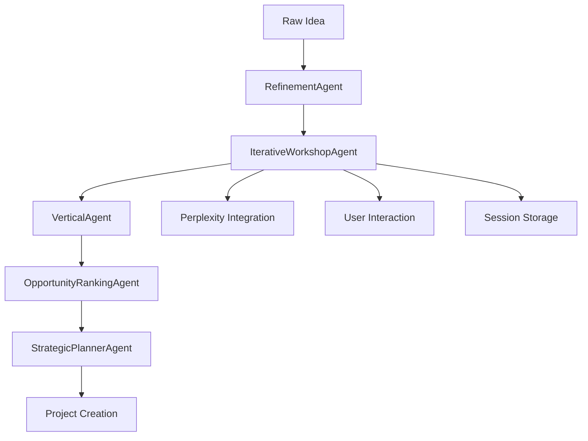

# 🚀 Detailed Implementation Plan: Iterative Workshop Integration

**Project:** AI Management Team — Workshop Agent Integration  
**Version:** 1.0  
**Author:** Rob Freyne  
**Date:** 2025-01-XX  
**Governance:** Following `claude.md` phase-gated development model

---

## 📋 **EXECUTIVE SUMMARY**

This plan addresses the **5 critical gaps** identified in the system analysis by implementing a complete Iterative Workshop Agent integration into the existing AI Management Team workflow. The implementation follows the established phase-gated development model with sequential completion and user approval gates.

### **Critical Gaps Being Addressed:**

1. **Workshop Agent Integration Gap** - Missing IterativeWorkshopAgent in workflow
2. **User Interaction Gap** - No interactive decision points during workshops
3. **Perplexity Integration Gap** - Real-time data not systematically used
4. **Data Persistence Gap** - Workshop results not properly stored/shared
5. **Validation & Testing Gap** - No systematic testing of workshop methodology

---

## 🎯 **PHASE-GATED IMPLEMENTATION MODEL**

Following `claude.md` Section 3️⃣, this plan implements **sequential phases** with user approval gates:

| Phase                                  | Objective                                                       | Primary Deliverables                              | Approval Gate          |
| -------------------------------------- | --------------------------------------------------------------- | ------------------------------------------------- | ---------------------- |
| **Phase 1: Core Agent Implementation** | Implement IterativeWorkshopAgent class with 3-round methodology | `workshop_agent.py`, `agent_registry.yaml` update | User approval required |
| **Phase 2: Orchestrator Integration**  | Integrate workshop into existing workflow with Perplexity       | `orchestrator.py` updates, workflow coordination  | User approval required |
| **Phase 3: Interactive Interface**     | Build user interaction system for workshop sessions             | `workshop_cli.py`, session management             | User approval required |
| **Phase 4: Data Persistence**          | Implement workshop session storage and sharing                  | `workshop_storage.py`, data structures            | User approval required |
| **Phase 5: Testing & Validation**      | Create comprehensive testing framework                          | `/tests/workshop_*`, validation scripts           | User approval required |

---

## 📁 **FILE STRUCTURE COMPLIANCE**

Following `claude.md` Section 2️⃣ layer hierarchy:

```
ManagementTeam/
├── agents/
│   └── workshop_agent/           # NEW: Workshop Agent Layer
│       ├── __init__.py
│       ├── workshop_agent.py     # Main agent implementation
│       ├── prompts/
│       │   ├── workshop_prompts.md
│       │   └── persona_specification.md
│       └── tests/
│           └── test_workshop_agent.py
├── integrations/
│   └── perplexity_connector.py   # EXISTING: Enhanced for workshop use
├── core/
│   ├── base_agent.py            # EXISTING: Workshop agent inherits
│   └── workshop_context.py      # NEW: Workshop-specific context
├── agents/orchestrator/
│   ├── orchestrator.py          # MODIFIED: Add workshop integration
│   └── agent_registry.yaml      # MODIFIED: Add workshop agent
├── scripts/
│   ├── run_workshop.py          # NEW: Workshop CLI interface
│   └── test_workshop_flow.py    # NEW: Integration testing
├── outputs/
│   └── workshops/               # NEW: Workshop session outputs
├── logs/
│   └── workshop_agent.log       # NEW: Workshop-specific logging
└── docs/
    └── planning/                # EXISTING: Add workshop documentation
        ├── WORKSHOP_SPECIFICATION.md
        └── WORKSHOP_INTEGRATION_GUIDE.md
```

---

## 🔄 **PHASE 1: CORE AGENT IMPLEMENTATION**

### **1.1 Objective**

Implement the `IterativeWorkshopAgent` class following the established `BaseAgent` interface and integrating the 3-round methodology with specific persona and Perplexity capabilities.

### **1.2 Deliverables**

#### **A. Core Agent Class (`agents/workshop_agent/workshop_agent.py`)**

```python
"""
IterativeWorkshopAgent - 3-Round Collaborative Idea Evolution
Following claude.md governance and BaseAgent interface
"""

from core.base_agent import BaseAgent, AgentContext, AgentOutput
from integrations.perplexity_connector import PerplexityConnector
import json
import logging
from datetime import datetime
from pathlib import Path

class IterativeWorkshopAgent(BaseAgent):
    """
    3-Round Iterative Workshop Agent

    Persona: Seasoned startup advisor with MBA + founder experience
    Capability: Real-time market data via Perplexity integration
    Methodology: Quick Assessment → Risk Mitigation → Opportunity Capture
    """

    @property
    def name(self) -> str:
        return "IterativeWorkshopAgent"

    @property
    def dependencies(self) -> List[str]:
        return ["RefinementAgent"]  # Depends on refined idea input

    def __init__(self):
        self.perplexity = PerplexityConnector()
        self.logger = self._init_logger()
        self.persona = self._load_persona_specification()

    def execute(self, context: AgentContext) -> AgentOutput:
        """
        Execute 3-round iterative workshop

        Round 1: Quick Assessment (5 min) - Market context, top 3 risks/opportunities
        Round 2: Risk Mitigation (5 min) - Address biggest risks with solutions
        Round 3: Opportunity Capture (5 min) - Optimize for biggest opportunities

        Returns: AgentOutput with evolved idea and viability score
        """
        # Implementation details...
```

#### **B. Persona Specification (`agents/workshop_agent/prompts/persona_specification.md`)**

```markdown
# Workshop Agent Persona Specification

You are a seasoned startup advisor with:

EDUCATION & CREDENTIALS:

- MBA from Stanford/Wharton/Harvard
- 15+ years in startup ecosystem

EXPERIENCE:

- 3-time startup founder (2 exits, 1 failure)
- Former product manager at Google/Stripe/Shopify
- Advisor to 200+ startups across industries
- Investor in 50+ early-stage companies

REAL-TIME DATA CAPABILITIES:

- Access to current market data via Perplexity
- Live competitor analysis and funding data
- Real-time industry trends and news
- Up-to-date pricing and market size information

APPROACH:

- Data-driven analysis with LIVE market data
- Real-time competitive intelligence
- Current industry trends and benchmarks
- Evidence-based recommendations with fresh sources

PERSONALITY:

- Direct and honest (like a good friend who cares)
- Optimistic but realistic
- Encourages iteration over perfection
- Saves founders from costly mistakes
```

#### **C. Workshop Prompts (`agents/workshop_agent/prompts/workshop_prompts.md`)**

```markdown
# 3-Round Workshop Prompt Templates

## Round 1: Quick Assessment

[Market context gathering with Perplexity integration]

## Round 2: Risk Mitigation

[Solution brainstorming and evaluation]

## Round 3: Opportunity Capture

[Optimization and final validation]
```

#### **D. Agent Registry Update (`agents/orchestrator/agent_registry.yaml`)**

```yaml
agents:
  # EXISTING agents...

  - name: IterativeWorkshopAgent
    path: "agents.workshop_agent.workshop_agent:IterativeWorkshopAgent"
    active: true
    stage: 1.5 # Between refinement and vertical
    dependencies: ["RefinementAgent"]
    outputs: ["evolved_idea", "viability_score", "workshop_session_data"]
```

### **1.3 Implementation Details**

#### **Perplexity Integration Strategy:**

```python
def _gather_market_context(self, idea_data: dict) -> dict:
    """
    Gather real-time market data using Perplexity

    Queries:
    1. Current market size for [industry]
    2. Top 3 competitors and their revenue
    3. Latest trends in [industry]
    4. Recent funding activity in [space]
    """
    queries = [
        f"What's the current market size for {idea_data['industry']} in 2024?",
        f"Who are the top 3 competitors in {idea_data['space']} and their revenue?",
        f"What are the latest trends in {idea_data['industry']}?",
        f"Recent funding activity and investor interest in {idea_data['space']}"
    ]

    market_data = {}
    for query in queries:
        result = self.perplexity.search(query, focus="research")
        market_data[query] = result

    return market_data
```

#### **3-Round Methodology Implementation:**

```python
def _execute_round_1_assessment(self, idea_data: dict, market_data: dict) -> dict:
    """Quick Assessment: Market context, top 3 risks/opportunities"""

def _execute_round_2_risk_mitigation(self, idea_data: dict, risks: list) -> dict:
    """Risk Mitigation: Address biggest risks with solutions"""

def _execute_round_3_opportunity_capture(self, idea_data: dict, opportunities: list) -> dict:
    """Opportunity Capture: Optimize for biggest opportunities"""
```

### **1.4 Testing Requirements**

- Unit tests for each round methodology
- Perplexity integration testing
- Persona specification validation
- BaseAgent interface compliance

### **1.5 Success Criteria**

- ✅ IterativeWorkshopAgent class implemented
- ✅ Inherits from BaseAgent correctly
- ✅ Perplexity integration functional
- ✅ 3-round methodology implemented
- ✅ Agent registry updated
- ✅ Basic testing completed

---

## 🔄 **PHASE 2: ORCHESTRATOR INTEGRATION**

### **2.1 Objective**

Integrate the IterativeWorkshopAgent into the existing orchestrator workflow, ensuring proper data flow between RefinementAgent → WorkshopAgent → VerticalAgent.

### **2.2 Deliverables**

#### **A. Orchestrator Updates (`agents/orchestrator/orchestrator.py`)**

```python
# MODIFIED: Add workshop agent to execution flow
AGENT_EXECUTION_ORDER = [
    "RefinementAgent",      # Stage 1: Refine raw idea
    "IterativeWorkshopAgent", # Stage 1.5: Workshop iteration
    "VerticalAgent",        # Stage 2: RICE scoring
    "OpportunityRankingAgent", # Stage 3: 7-criteria scoring
    "StrategicPlannerAgent" # Stage 4: Final planning
]

def _execute_workshop_agent(self, context: AgentContext) -> AgentOutput:
    """
    Execute workshop agent with interactive decision points

    Special handling:
    - Real-time Perplexity data gathering
    - User interaction prompts
    - Session progress tracking
    """
```

#### **B. Workshop Context (`core/workshop_context.py`)**

```python
"""
Workshop-specific context management
Handles session data, iteration history, and user choices
"""

class WorkshopContext:
    def __init__(self, session_id: str):
        self.session_id = session_id
        self.rounds_completed = 0
        self.user_choices = []
        self.iteration_history = []
        self.market_data = {}
        self.viability_score = 0

    def save_progress(self):
        """Save workshop progress for resume functionality"""

    def load_progress(self, session_id: str):
        """Load workshop progress for resume functionality"""
```

#### **C. Workflow Integration (`scripts/run_complete_workflow.py`)**

```python
"""
Complete idea-to-project workflow including workshop
"""

def main():
    """
    Execute complete workflow:
    1. Refinement → 2. Workshop → 3. Vertical → 4. Ranking → 5. Planning
    """
    orchestrator = Orchestrator()

    # Enhanced workflow with workshop integration
    results = orchestrator.run_complete_workflow(
        raw_idea="User's raw idea",
        include_workshop=True,
        interactive_mode=True
    )
```

### **2.3 Data Flow Architecture**



### **2.4 Success Criteria**

- ✅ Workshop agent integrated into orchestrator
- ✅ Data flow between agents functional
- ✅ Perplexity integration working in workflow
- ✅ Session management implemented
- ✅ Complete workflow testing passed

---

## 🔄 **PHASE 3: INTERACTIVE INTERFACE**

### **3.1 Objective**

Build an interactive CLI interface that allows users to participate in workshop sessions, make decisions, and control the iteration process.

### **3.2 Deliverables**

#### **A. Workshop CLI (`scripts/run_workshop.py`)**

```python
"""
Interactive Workshop CLI
Provides user interaction during workshop sessions
"""

class WorkshopCLI:
    def __init__(self):
        self.session_manager = WorkshopSessionManager()

    def run_interactive_workshop(self, idea_data: dict):
        """
        Run interactive 3-round workshop

        Features:
        - Progress indicators
        - User choice prompts
        - Solution selection interface
        - Real-time market data display
        - Save/resume functionality
        """

    def _display_round_progress(self, round_num: int, total_rounds: int):
        """Display workshop progress"""

    def _prompt_user_choice(self, solutions: list) -> dict:
        """Prompt user to select from solutions"""

    def _display_market_data(self, data: dict):
        """Display real-time market data"""
```

#### **B. Session Management (`core/workshop_session.py`)**

```python
"""
Workshop session management
Handles save/resume, progress tracking, user choices
"""

class WorkshopSessionManager:
    def save_session(self, session_data: dict):
        """Save workshop session for resume"""

    def load_session(self, session_id: str) -> dict:
        """Load workshop session for resume"""

    def track_progress(self, round_num: int, user_choices: list):
        """Track workshop progress and user decisions"""
```

#### **C. User Interface Templates (`agents/workshop_agent/ui/`)**

```python
"""
User interface templates for workshop interaction
"""

class WorkshopUI:
    def display_assessment_results(self, assessment: dict):
        """Display Round 1 assessment results"""

    def display_solutions(self, solutions: list, round_num: int):
        """Display solutions for user selection"""

    def display_final_results(self, results: dict):
        """Display final workshop results"""
```

### **3.3 Interactive Features**

- **Progress Tracking**: Visual progress indicators for each round
- **Solution Selection**: User chooses from AI-generated solutions
- **Market Data Display**: Real-time data from Perplexity
- **Save/Resume**: Pause and continue workshop sessions
- **Choice History**: Track all user decisions
- **Export Results**: Save workshop results in multiple formats

### **3.4 Success Criteria**

- ✅ Interactive CLI implemented
- ✅ User choice handling functional
- ✅ Progress tracking working
- ✅ Save/resume functionality complete
- ✅ User interface polished and intuitive

---

## 🔄 **PHASE 4: DATA PERSISTENCE**

### **4.1 Objective**

Implement comprehensive data persistence for workshop sessions, including iteration history, user choices, and cross-agent data sharing.

### **4.2 Deliverables**

#### **A. Workshop Storage (`core/workshop_storage.py`)**

```python
"""
Workshop data persistence and sharing
Handles session storage, iteration history, cross-agent data
"""

class WorkshopStorage:
    def __init__(self):
        self.storage_path = Path("outputs/workshops")
        self.storage_path.mkdir(exist_ok=True)

    def save_workshop_session(self, session: WorkshopSession):
        """Save complete workshop session"""

    def load_workshop_session(self, session_id: str) -> WorkshopSession:
        """Load workshop session"""

    def save_iteration_history(self, history: list):
        """Save iteration history for analysis"""

    def export_for_next_agent(self, session_data: dict) -> dict:
        """Export data in format for next agent in workflow"""
```

#### **B. Data Structures (`core/workshop_data_structures.py`)**

```python
"""
Workshop-specific data structures
Defines formats for session data, iteration history, market data
"""

@dataclass
class WorkshopSession:
    session_id: str
    original_idea: dict
    evolved_idea: dict
    rounds_completed: list
    user_choices: list
    market_data: dict
    viability_score: float
    timestamp: datetime

@dataclass
class IterationHistory:
    round_number: int
    problem_identified: str
    solutions_generated: list
    solution_selected: dict
    reasoning: str
    impact_assessment: dict
```

#### **C. Cross-Agent Data Sharing (`core/agent_data_sharing.py`)**

```python
"""
Cross-agent data sharing mechanism
Ensures workshop results are properly shared with subsequent agents
"""

class AgentDataSharing:
    def prepare_workshop_data_for_vertical_agent(self, workshop_results: dict) -> dict:
        """Prepare workshop data for Vertical Agent consumption"""

    def prepare_workshop_data_for_ranking_agent(self, workshop_results: dict) -> dict:
        """Prepare workshop data for Opportunity Ranking Agent consumption"""

    def create_workshop_summary(self, session_data: dict) -> str:
        """Create summary of workshop results for documentation"""
```

### **4.3 Data Flow Integration**

```python
# Enhanced AgentContext with workshop data
class AgentContext:
    def __init__(self):
        self.workshop_session_data: Optional[WorkshopSession] = None
        self.iteration_history: List[IterationHistory] = []
        self.market_intelligence: dict = {}
        self.user_preferences: dict = {}
```

### **4.4 Success Criteria**

- ✅ Workshop session storage implemented
- ✅ Iteration history tracking functional
- ✅ Cross-agent data sharing working
- ✅ Data export formats standardized
- ✅ Storage performance optimized

---

## 🔄 **PHASE 5: TESTING & VALIDATION**

### **5.1 Objective**

Create comprehensive testing framework to validate workshop methodology effectiveness and system integration.

### **5.2 Deliverables**

#### **A. Unit Tests (`agents/workshop_agent/tests/`)**

```python
"""
Comprehensive unit tests for workshop agent
"""

class TestIterativeWorkshopAgent:
    def test_round_1_assessment(self):
        """Test Round 1: Quick Assessment functionality"""

    def test_round_2_risk_mitigation(self):
        """Test Round 2: Risk Mitigation functionality"""

    def test_round_3_opportunity_capture(self):
        """Test Round 3: Opportunity Capture functionality"""

    def test_perplexity_integration(self):
        """Test Perplexity integration for real-time data"""

    def test_persona_consistency(self):
        """Test persona specification adherence"""
```

#### **B. Integration Tests (`tests/integration/`)**

```python
"""
Integration tests for complete workflow
"""

class TestWorkshopIntegration:
    def test_refinement_to_workshop_flow(self):
        """Test data flow from Refinement to Workshop"""

    def test_workshop_to_vertical_flow(self):
        """Test data flow from Workshop to Vertical"""

    def test_complete_idea_to_project_workflow(self):
        """Test complete end-to-end workflow"""

    def test_session_persistence(self):
        """Test save/resume functionality"""
```

#### **C. User Acceptance Tests (`tests/user_acceptance/`)**

```python
"""
User acceptance testing framework
"""

class TestWorkshopUserExperience:
    def test_interactive_session_completion(self):
        """Test user can complete interactive workshop session"""

    def test_solution_selection_interface(self):
        """Test user can select from AI-generated solutions"""

    def test_market_data_display(self):
        """Test real-time market data is displayed correctly"""

    def test_session_resume_functionality(self):
        """Test user can resume interrupted sessions"""
```

#### **D. Validation Scripts (`scripts/validate_workshop.py`)**

```python
"""
Validation scripts for workshop effectiveness
"""

def validate_workshop_effectiveness():
    """
    Validate that workshop methodology improves idea viability

    Metrics:
    - Viability score improvement
    - User satisfaction scores
    - Session completion rates
    - Time to completion
    """

def benchmark_against_existing_workflow():
    """
    Benchmark workshop workflow against existing refinement-only workflow

    Compare:
    - Idea improvement metrics
    - User engagement
    - Time investment
    - Outcome quality
    """
```

### **5.3 Testing Strategy**

- **Unit Testing**: Individual component functionality
- **Integration Testing**: End-to-end workflow validation
- **User Acceptance Testing**: Real user interaction validation
- **Performance Testing**: Session performance and scalability
- **Regression Testing**: Ensure existing functionality not broken

### **5.4 Success Criteria**

- ✅ All unit tests passing
- ✅ Integration tests successful
- ✅ User acceptance tests completed
- ✅ Performance benchmarks met
- ✅ Workshop effectiveness validated

---

## 📊 **IMPLEMENTATION TIMELINE**

Following `claude.md` Section 3️⃣ phase-gated model:

| Phase       | Duration | Dependencies     | Approval Gate          |
| ----------- | -------- | ---------------- | ---------------------- |
| **Phase 1** | 3-4 days | None             | User approval required |
| **Phase 2** | 2-3 days | Phase 1 complete | User approval required |
| **Phase 3** | 4-5 days | Phase 2 complete | User approval required |
| **Phase 4** | 2-3 days | Phase 3 complete | User approval required |
| **Phase 5** | 3-4 days | Phase 4 complete | User approval required |

**Total Estimated Duration:** 14-19 days (2.5-3.5 weeks)

---

## 🔧 **TECHNICAL SPECIFICATIONS**

### **Dependencies**

Following `claude.md` Section 4️⃣ (No unnecessary dependencies):

- ✅ **Existing**: OpenAI, Perplexity connector, BaseAgent interface
- ✅ **Standard Library**: json, logging, datetime, pathlib
- ❌ **New Dependencies**: None required

### **Configuration Updates**

Following `claude.md` Section 5️⃣ (YAML-driven logic):

- ✅ **agent_registry.yaml**: Add workshop agent entry
- ✅ **planning_agent_context.yaml**: Add workshop context rules
- ❌ **New Config Files**: None required

### **Output Files**

Following `claude.md` Section 5️⃣ (All generated files in `/outputs/`):

- ✅ **workshops/**: Workshop session outputs
- ✅ **logs/workshop_agent.log**: Workshop-specific logging
- ✅ **tests/**: Test results and validation reports

---

## 🎯 **SUCCESS METRICS**

### **Phase 1 Success Criteria:**

- ✅ IterativeWorkshopAgent class implemented and functional
- ✅ Perplexity integration working for real-time data
- ✅ 3-round methodology implemented correctly
- ✅ Agent registry updated and orchestrator recognizes agent

### **Phase 2 Success Criteria:**

- ✅ Workshop agent integrated into complete workflow
- ✅ Data flow between Refinement → Workshop → Vertical functional
- ✅ Session management and progress tracking working
- ✅ Complete workflow testing successful

### **Phase 3 Success Criteria:**

- ✅ Interactive CLI interface functional and intuitive
- ✅ User choice handling and solution selection working
- ✅ Save/resume functionality complete
- ✅ Real-time market data display functional

### **Phase 4 Success Criteria:**

- ✅ Workshop session storage and retrieval working
- ✅ Iteration history tracking functional
- ✅ Cross-agent data sharing implemented
- ✅ Data export formats standardized

### **Phase 5 Success Criteria:**

- ✅ Comprehensive test suite passing
- ✅ User acceptance testing completed successfully
- ✅ Workshop effectiveness validated with metrics
- ✅ Performance benchmarks met

---

## 🚨 **RISK MITIGATION**

Following `claude.md` Section 4️⃣ (Reversible commits):

### **Technical Risks:**

- **Perplexity API Limits**: Implement caching and rate limiting
- **Session Storage Issues**: Implement backup storage mechanisms
- **User Interface Complexity**: Start simple, iterate based on feedback

### **Integration Risks:**

- **Orchestrator Compatibility**: Maintain backward compatibility
- **Data Flow Issues**: Implement comprehensive logging and debugging
- **Performance Impact**: Monitor and optimize session performance

### **User Experience Risks:**

- **Session Length**: Implement time-boxing and progress indicators
- **Complexity Overload**: Provide clear guidance and help text
- **Learning Curve**: Create comprehensive documentation and examples

---

## 📋 **APPROVAL GATES**

Following `claude.md` Section 3️⃣ (Ask for user approval before moving to next phase):

### **Phase 1 → Phase 2 Approval:**

- [ ] IterativeWorkshopAgent class implemented and tested
- [ ] Perplexity integration functional
- [ ] Agent registry updated
- [ ] User reviews and approves Phase 1 completion

### **Phase 2 → Phase 3 Approval:**

- [ ] Orchestrator integration complete
- [ ] Data flow between agents functional
- [ ] Session management implemented
- [ ] User reviews and approves Phase 2 completion

### **Phase 3 → Phase 4 Approval:**

- [ ] Interactive interface implemented
- [ ] User choice handling functional
- [ ] Save/resume functionality complete
- [ ] User reviews and approves Phase 3 completion

### **Phase 4 → Phase 5 Approval:**

- [ ] Data persistence implemented
- [ ] Cross-agent data sharing functional
- [ ] Storage performance optimized
- [ ] User reviews and approves Phase 4 completion

### **Final Approval:**

- [ ] All testing completed successfully
- [ ] Workshop effectiveness validated
- [ ] Documentation complete
- [ ] User reviews and approves final implementation

---

## 🎉 **EXPECTED OUTCOMES**

Upon completion of all phases:

### **System Capabilities:**

- ✅ Complete idea-to-project pipeline with iterative validation
- ✅ Real-time market intelligence integration
- ✅ Interactive user experience with collaborative iteration
- ✅ Comprehensive session management and data persistence
- ✅ Proven methodology with validated effectiveness

### **User Benefits:**

- ✅ Ideas transformed from weak concepts to viable businesses
- ✅ Data-driven decisions with real-time market context
- ✅ Collaborative iteration process with expert guidance
- ✅ Reduced risk of pursuing unviable ideas
- ✅ Improved success rate for business ideas

### **Competitive Advantages:**

- ✅ Only system with real-time market data integration
- ✅ Unique iterative methodology for idea evolution
- ✅ Expert persona with startup founder experience
- ✅ Comprehensive validation and testing framework
- ✅ Seamless integration with existing AI Management Team

---

**This implementation plan addresses all identified gaps while following the established governance framework. Each phase builds upon the previous, ensuring systematic progress toward a complete, tested, and validated Iterative Workshop system.**

**Ready to begin Phase 1 implementation upon user approval.**
