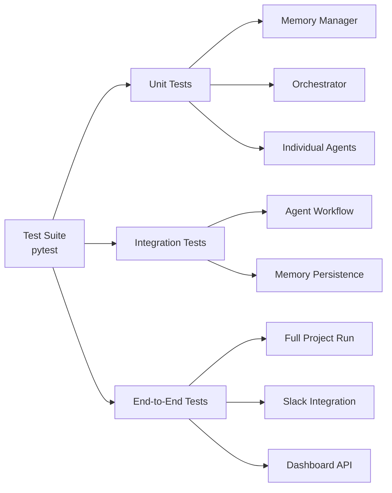

# 🧩 SYSTEM ARCHITECTURE DIAGRAM – AI MANAGEMENT-TEAM SYSTEM

**Version:** 1.0 | **Date:** 2025-10-08 | **Maintainer:** Founder (Rob)

---

## 🧠 HIGH-LEVEL OVERVIEW

```mermaid
flowchart TD
    %% === CORE NODES ===
    subgraph A[Founder Oversight Layer]
        SLACK[💬 Slack Interface<br>(Approvals & Alerts)]
        DASH[📊 Dashboard UI<br>(FastAPI + React)]
    end

    subgraph B[Claude Coordination Layer]
        CLAUDE[🤖 Claude<br>System + Rules + Config]
        ORCH[⚙️ Orchestrator.py<br>Task Coordination]
    end

    subgraph C[Agent Layer]
        STRAT[📈 Strategy Agent]
        FIN[💰 Financial Agent]
        TECH[🧰 Technical Agent]
        OPS[🏢 Operations Agent]
        DATA[📊 Data Agent]
    end

    subgraph D[Memory & Data Layer]
        MEM[🧠 Persistent Memory<br>(JSON per Agent)]
        VEC[🔍 Vector Memory (Future)<br>Chroma / Weaviate]
        LOGS[🧾 Logs<br>(JSONL structured logs)]
        DB[(🗄️ Data Sources<br>Market / Project Data)]
    end

    subgraph E[Automation & Maintenance Layer]
        MAINT[scripts/maintenance_tasks.py]
        SETUP[scripts/setup_environment.sh/.bat]
    end

    %% === CONNECTIONS ===
    SLACK <--> ORCH
    DASH <--> ORCH

    CLAUDE --> ORCH
    ORCH --> STRAT
    ORCH --> FIN
    ORCH --> TECH
    ORCH --> OPS
    ORCH --> DATA

    STRAT --> MEM
    FIN --> MEM
    TECH --> MEM
    OPS --> MEM
    DATA --> MEM

    MEM <--> VEC
    ORCH --> LOGS
    MAINT --> LOGS
    MAINT --> MEM
    MAINT --> DB

    SETUP --> MAINT
    MAINT --> CLAUDE
```

---

## 📊 LAYER BREAKDOWN

### 1️⃣ Founder Oversight Layer

**Purpose:** Human-in-the-loop control and monitoring

| Component           | Status     | Function                                     |
| ------------------- | ---------- | -------------------------------------------- |
| **Slack Interface** | 🕓 Phase 2 | Real-time notifications, approval workflows  |
| **Dashboard UI**    | 🔜 Phase 4 | Visual analytics, agent performance tracking |

**Communication Flow:**

- Orchestrator sends notifications → Slack
- Founder approves/rejects → Orchestrator continues workflow
- Dashboard displays real-time agent status and metrics

---

### 2️⃣ Claude Coordination Layer

**Purpose:** AI reasoning and workflow management

| Component         | Status    | Function                                                       |
| ----------------- | --------- | -------------------------------------------------------------- |
| **Claude System** | ✅ Active | Reads governance docs, interprets rules, generates agent logic |
| **Orchestrator**  | ✅ Active | Sequential agent execution, memory management, logging         |

**Files:**

- `claude/config.yaml` - Claude configuration
- `.claude/rules.md` - Operational rules
- `docs/system/claude.md` - Working guidelines
- `scripts/orchestrator.py` - Main coordinator

**Workflow:**

1. Claude reads governance documents
2. Orchestrator loads agent memory
3. Executes agents in sequence
4. Updates memory and logs results

---

### 3️⃣ Agent Layer

**Purpose:** Specialized AI agents for decision-making

| Agent          | Focus               | Inputs                    | Outputs              |
| -------------- | ------------------- | ------------------------- | -------------------- |
| **Strategy**   | Market positioning  | Proposals, trends         | Strategy reports     |
| **Financial**  | ROI validation      | Strategy reports, pricing | Financial reviews    |
| **Technical**  | Architecture        | Strategy reports, specs   | Architecture reviews |
| **Operations** | Execution planning  | All reviews               | Operations plans     |
| **Data**       | Performance metrics | Operations plans, results | Performance reports  |

**Execution Order:**

```
Strategy → Financial → Technical → Operations → Data
```

**Current Status:**

- Definitions: ✅ Complete (`management_team_agent_definitions.yaml`)
- Implementation: 🕓 Next phase

---

### 4️⃣ Memory & Data Layer

**Purpose:** Persistent storage and knowledge retention

| Component         | Type        | Status     | Location             |
| ----------------- | ----------- | ---------- | -------------------- |
| **JSON Memory**   | Structured  | ✅ Active  | `/memory/*.json`     |
| **Vector Memory** | Semantic    | 🔜 Phase 3 | ChromaDB integration |
| **JSONL Logs**    | Audit trail | ✅ Active  | `/logs/*.jsonl`      |
| **Data Sources**  | Input files | ✅ Ready   | `/data/**/*`         |

**Memory Structure:**

```json
{
  "agent": "strategy_agent",
  "last_updated": "2025-10-08T14:30:00",
  "project_history": [...],
  "summary_snapshot": {...}
}
```

**Log Format:**

```jsonl
{"event": "memory_loaded", "agent": "strategy_agent", "memory": {...}}
{"event": "agent_result", "agent": "strategy_agent", "result": {...}}
```

---

### 5️⃣ Automation & Maintenance Layer

**Purpose:** System health and dependency management

| Component             | Frequency | Function                                     |
| --------------------- | --------- | -------------------------------------------- |
| **Maintenance Tasks** | Weekly    | Archive logs, trim memory, sync dependencies |
| **Setup Scripts**     | On-demand | Initialize environment, create folders       |

**Maintenance Functions:**

1. **Archive Old Logs** - Move logs >14 days to archive
2. **Summarize Memory** - Trim to 10 most recent projects
3. **Sync Dependencies** - Update `requirements.txt`
4. **Validate Structure** - Ensure all folders exist

**Commands:**

```bash
# Run maintenance
python scripts/maintenance_tasks.py

# Setup environment
./setup_environment.sh  # macOS/Linux
setup_environment.bat   # Windows
```

---

## 🔄 DATA FLOW EXAMPLE

### Scenario: Evaluating "AI Receptionist" Project

```
1. Proposal Submitted
   └─> data/project_proposals/ai_receptionist.yaml

2. Orchestrator Launches
   └─> Reads system_context.yaml for workflow order

3. Strategy Agent
   ├─> Loads memory/strategy_agent.json
   ├─> Analyzes market opportunity
   ├─> Scores against decision criteria
   ├─> Saves to data/reports/strategy_report_2025-10-08.md
   └─> Updates memory with decision

4. Financial Agent
   ├─> Reads strategy_report_2025-10-08.md
   ├─> Calculates ROI projections
   ├─> Validates budget requirements
   ├─> Saves to data/reports/financial_review_2025-10-08.md
   └─> Updates memory

5. Technical Architect
   ├─> Reviews technical feasibility
   ├─> Checks compliance requirements
   ├─> Saves architecture_review_2025-10-08.md
   └─> Updates memory

6. Operations Agent
   ├─> Reads all previous reports
   ├─> Creates implementation roadmap
   ├─> Saves operations_plan_2025-10-08.md
   └─> Updates memory

7. Data Agent
   ├─> Defines success metrics
   ├─> Sets up KPI tracking
   ├─> Saves performance_report_2025-10-08.md
   └─> Updates memory

8. Final Decision
   ├─> Composite score: 4.3 (above 4.0 threshold)
   ├─> Status: APPROVED
   ├─> Notification sent to Slack (future)
   └─> Logged to logs/2025-10-08_AI_Receptionist.jsonl
```

---

## 🔐 SECURITY FLOW

```
┌─────────────────────────────────────┐
│  Environment Variables (.env)       │
│  - Never committed to git           │
│  - Loaded at runtime only           │
└──────────────┬──────────────────────┘
               ↓
┌─────────────────────────────────────┐
│  Orchestrator & Agents              │
│  - No PII in logs by default        │
│  - GDPR compliance checks           │
│  - Technical Architect validates    │
└──────────────┬──────────────────────┘
               ↓
┌─────────────────────────────────────┐
│  Logs & Memory                      │
│  - Structured, redacted data        │
│  - Archived after 14 days           │
│  - Full audit trail maintained      │
└─────────────────────────────────────┘
```

---

## 🧪 TESTING ARCHITECTURE



**Test Status:**

- Unit Tests: 🕓 To be implemented
- Integration Tests: 🕓 To be implemented
- E2E Tests: 🕓 To be implemented

---

## 📦 DEPLOYMENT ARCHITECTURE (Future)

```
┌─────────────────────────────────────┐
│  Docker Container                   │
│  ├── Python 3.11                    │
│  ├── All dependencies               │
│  ├── Orchestrator                   │
│  └── Agents                         │
└──────────────┬──────────────────────┘
               ↓
┌─────────────────────────────────────┐
│  Kubernetes / Cloud Run             │
│  - Auto-scaling                     │
│  - Health checks                    │
│  - Rolling updates                  │
└──────────────┬──────────────────────┘
               ↓
┌─────────────────────────────────────┐
│  External Services                  │
│  ├── Slack API                      │
│  ├── Database (PostgreSQL)          │
│  └── Vector DB (ChromaDB/Weaviate)  │
└─────────────────────────────────────┘
```

---

## 🔗 INTEGRATION POINTS

### Current

- ✅ File system (JSON, JSONL, YAML, Markdown)
- ✅ Python subprocess for maintenance
- ✅ Environment variables for config

### Planned Phase 2

- 🕓 Slack Webhooks (outbound notifications)
- 🕓 YAML config loading (dynamic workflow)

### Planned Phase 3

- 🔜 ChromaDB (vector memory)
- 🔜 FastAPI (REST API)
- 🔜 Slack Events API (inbound approvals)

### Planned Phase 4

- 🔜 React Dashboard (UI)
- 🔜 WebSocket (real-time updates)
- 🔜 PostgreSQL (long-term storage)

---

## 📈 SCALABILITY CONSIDERATIONS

| Layer          | Current          | Future Scaling                           |
| -------------- | ---------------- | ---------------------------------------- |
| **Agents**     | Sequential       | Parallel execution for independent tasks |
| **Memory**     | JSON files       | Hybrid (JSON + Vector + DB)              |
| **Storage**    | Local filesystem | Cloud storage (S3/GCS)                   |
| **Compute**    | Single process   | Distributed workers                      |
| **Monitoring** | File logs        | Centralized logging (ELK stack)          |

---

## 🧠 KNOWLEDGE FLOW

```
Governance Docs → Claude → Orchestrator → Agents → Memory → Learning
     ↑                                                         ↓
     └─────────────────── Feedback Loop ─────────────────────┘
```

1. **Governance Docs** define rules and processes
2. **Claude** reads and interprets governance
3. **Orchestrator** coordinates agent execution
4. **Agents** make decisions based on rules
5. **Memory** stores outcomes
6. **Learning** updates rules and weights
7. **Loop** continues, improving over time

---

## 📚 RELATED DOCUMENTATION

- `file_structure.md` - Complete file organization
- `system_context.yaml` - Workflow dependencies
- `orchestrator_README.md` - Orchestrator usage
- `orchestrator_extensions.md` - Future features
- `PRD_summary.md` - Product requirements

---

**Version:** 1.0  
**Last Updated:** 2025-10-08  
**Next Review:** Q4 2025  
**Status:** ✅ Architecture Defined - Ready for Implementation
